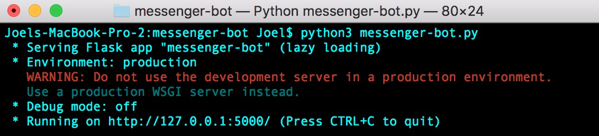

# Facebook Messenger Bot

## Introduction

This document will provide a step-by-step gudie to developing your first Facebook Messenger bot. We'll be using Python since it's a very beginner-friendly language and offers perhaps the simplest implementation. Alternatively, you're welcome to use JavaScript + Node.js, in which case you can find an excellent guide with [Facebook's Quick Start Tutorial](https://developers.facebook.com/docs/messenger-platform/getting-started/quick-start/).

There are a few components that we have to set up in order to get a functional bot. First, we need to set up a server to listen for messages from Facebook. This is a stable point so that Facebook knows what to do when the user messages the bot. *Flask* is a web framework built on Python, so we'll use it to greatly simplify this process. Next, we'll need to enable the bot to respond to the user's messages. We'll code the logic in Python and use the *requests* library to sent the bot's chosen response back to Facebook. Finally, since we're developing this locally, we can use a cool tool called *ngrok* to expose the code on our local machine to the web, so that we don't have to host this anywhere and can run our bot from our local machine. We'll explain each of these steps in more detail as we go through them. 

For a simple, instructive example, we'll configure our Messenger bot to 


## Software

Before we begin, we need to make sure all the necessary software is installed. Here are the things you'll need:
* [Python 3.6.5](https://www.python.org/downloads/release/python-365/)
* Pip3 (we'll show you how to install this later)


### Cygwin installation (Windows users only)

Visit [this website](https://cygwin.com/install.html) to install Cygwin.  For each screen on the installer where it provides a default option, the default is fine.  However, there is one screen that asks you to "Choose A Download Site".  Any site should work; however, some work better than others.  [This site](https://mirror.steadfast.net) works well.

From this point on, whenever the tutorial says to use the terminal, you should use Cygwin instead.

### Dependencies
Most newer versions of Python come with pip, so it should be already installed. Specifically, we want to have pip3 installed. To check if you have pip installed already, type `which pip3` into the terminal. You should see the version number printed to the terminal if you have it.

If you don't have pip, you can install it [here](https://pip.pypa.io/en/stable/installing/).

Our application has two dependencies -- *Flask*, which is a web framework, and *pymessenger*, which is a Python wrapper over the Facebook Messenger API. We can install the libraries by entering the following two lines into terminal

```bash
pip3 install Flask==0.12.2
pip3 install pymessenger==0.0.7.0
```

## Implementation

To begin, we’ll create a basic Flask app called `messenger-bot.py`. If you have not used Flask before, or are unfamiliar with [web frameworks](https://www.fullstackpython.com/web-frameworks.html), you should look at their [introduction](http://flask.pocoo.org/docs/0.12/quickstart/) to understand how the framework functions. 

```python
from flask import Flask, request

app = Flask(__name__)
@app.route('/', methods=['GET', 'POST'])
def receive_message():
    return "Hello World!"


if __name__ == '__main__':
    app.run()
```

Using Flask, we can create an endpoint – a fancy way of referring to a website url. For example, in http://rice.edu/about the endpoint is “/about.” In the code above, our endpoint is empty, so the receive_message() function will be called when a client navigates to our url. Once our app is complete, when a user sends us a message, Facebook will send that data to our endpoint, where we will send a response back to Facebook to show the user. 

You can try running the above code as it is, by entering `python3 messenger-bot.py` into terminal, and you should get a response like this:




